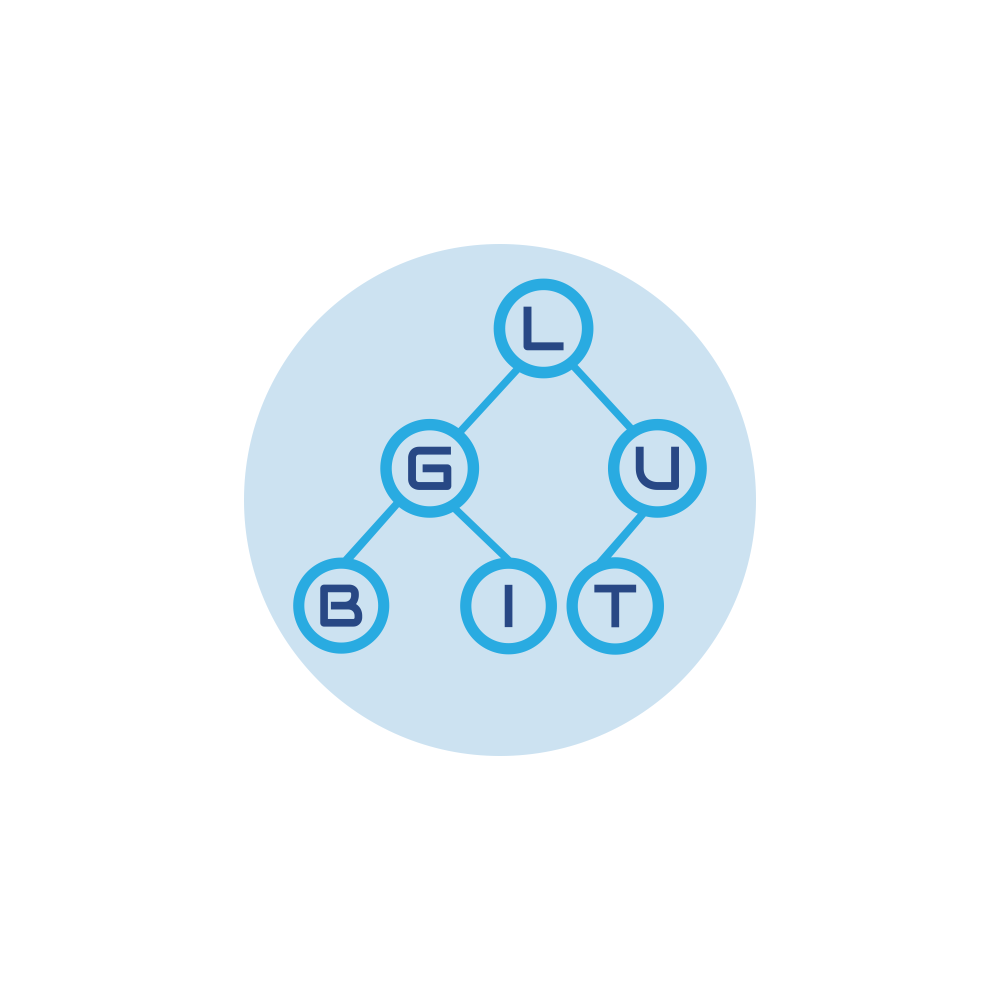

<html>
    <p align="center">
        
    </p>
</html>

## Golang authentication and sessions
A custom registration, authentication and session handling implemented in Golang and MySQL.

## Motivation
This project was started purely as a learning tool to aid myself with learning Golang and specifically web development with Golang. I wanted to incorporate Go with a RDBMS such as MySQL as well as implement other features such as account verification upon sign up and sessions without the use of a framework.
 
## Screenshots


## Tech/packages used
- [Golang](https://golang.org/)
- [Go-MySQL-Driver](github.com/go-sql-driver/mysql)
- [UUID package for Go language](https://github.com/satori/go.uuid)
- [gotenv](github.com/subosito/gotenv)
- [Bootstrap 4](https://getbootstrap.com/)

## Features
* Registration and activation
    - Activation link is sent to the user's registration email with a UUID token embedded upon signing up. This one time use link must be used before it is expired or it will not activate the associated account.
    - Activation links are one time use. Once clicked, it will be marked as used in the database and cannot be used again.
    - Activaton links can be resent by visiting the /send-activation route which will generate a new activation link with a new expiry date.
* Authentication
    - Registered users with activated accounts can login with their email and password.
    - The email address the user enters is checked against the database. If the email exists, the password entered is hashed and compared against the hashed password entry in the database and if the hash matches, the user is logged in and a session is created.
* Sessions
    - Once a user successfully authenticates, a session is created.
    - The UUID generated upon logging in is inserted in the sessions table with the user's unique id.
    - A cookie is sent to the client with the same UUID that was inserted in the database.
    - When a user makes a request for a secured route e.g. /my-profile, the session cookie is received by the server and verified against the sessions table. If the same UUID in the cookie is also present in the sessions table, the user is granted access to the secured route.
    - Sessions and cookies have a maximum life before they expire, once expired, the user will need to login again.
    - Sessions and cookies are automatically renewed when the user makes a request to any secured routes. This will reset the max life of the session and cookie.
    - Session entries along with the session cookie is destroyed upon logging out.
* Input validation
    - The registration, login and any routes with input forms are validated to make sure they are not empty, have the correct format or unique if a user is entering their email address on sign up.

## How to use
* Load the MySQL database schema located at ./static/db/userAuthDBSchema.sql
* Set the app environment variables located at ./.env
    - DB_USERNAME = Your MySQL server username
    - DB_PASSWORD = Your MySQL server password
    - DB_ADDRESS = Your MySQL server address
    - DB_PORT = Your MySQL server port 
    - DB_NAME = The database name, the default is "userAuthDB" as set on the schema.
    - SENDER_ADDRESS = Verification link sender email address
    - SENDER_PASSWORD = Verification link sender email address password
    - SMTP_SERVER = Verification link sender email address SMTP server
* Build the binary by running go build and then run the executable
```
go build

```
* Visit localhost:8080 on your web browser

## Credits
Thanks to [Todd McLeod](https://github.com/GoesToEleven) and particularly his course on Udemy([Course Repo](https://github.com/GoesToEleven/golang-web-dev)).

## License
MIT License

Copyright (c) 2018 Marck Muñoz
